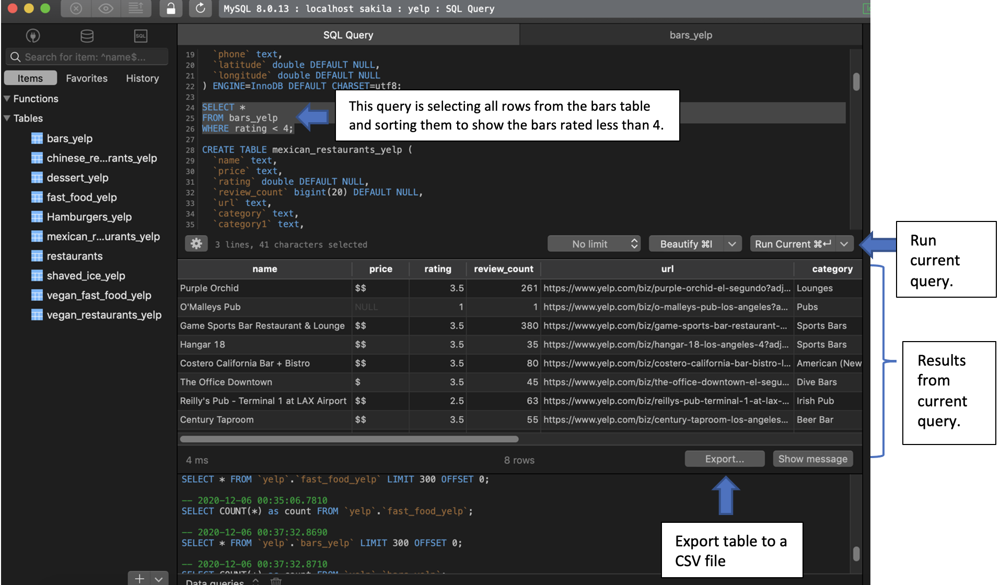

# Database Project
By Marissa Alvarez
In Spring of 2019 I completed this Database project. I analyzed data on local restaurants in order to determine rating patterns for establishments, analyze restaurant categories in an area, and discovered categories that were heavily populated near my university. The technologies used were the following: Python, TablePlus, MySQL, Anaconda, and Tableau. I utilized Python to web scrape the data from the Yelp API. I used the following URL for our search: url='https://api.yelp.com/v3/businesses/search'
You can modify the parameters. We wanted to search for fast food near the LAX area and limited the search to 50 places: params = {'term':'fast food','location':'90045','limit':'50'}
Then, I made a get request to the API and if it was successful, I cleaned up the data by loading it as JSON. By viewing the first entry I was able to view the fields that were needed. I cleaned up the data even more due to the categories field having multiple dictionaries. To separate the data I used the pd.series in pandas to separate the dictionary into its own column. Then, I renamed the columns that had names separated by a period. I finalized and chose the columns I wanted and assigned them to a final data frame. Finally, I used the create engine to connect to a MySQL database.  By knowing the different data types I was able to import from the data scrape I did in Python. I was able to view the data pertaining to the certain URL and my parameters. I was able to create several other tables by changing the parameters. Once the data was loaded, I was able to view each table. I used MySQL using the TablePlus GUI for relational databases.

I queried the database to gather and sort the data that I wanted to know. For example, I was able to query the database to search for restaurants that had a rating of less than 4. I was able to modify that to view all restaurants with a rating greater than 4.

Once I had the different tables created, I established a connection to my Tableau desktop application. I created data visualizations to come to conclusions about the data gathered. Data visualizations helped create a story about the data collected.

Outcomes:
I was able to utilize the Yelp API to create a table in my database. I then created visual to analyze the data.  It clearly showed what restaurant categories were lacking in certain areas. The data collected might help a business owner view the competition and how they might want to make their business stand out.

[Link to Code](https://malvarez27.github.io/yelpFinal/)

[Slides](https://malvarez27.github.io/yelpDBFinalSlides/#/)

[Tebleau Results](https://raw.githubusercontent.com/malvarez27/yelpDB/main/SQL%20Project.pptx)
